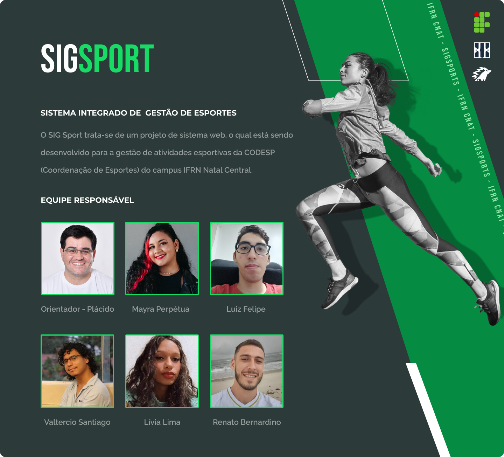

# Acesse nossa plataforma [aqui](http://valterciosj.pythonanywhere.com/solicitarMatricula)

## Documentação

Este sistema vem sendo desenvolvido na disciplina de Projeto de Desenvolvimento de Sistemas (PDS), aplicando os conhecimentos obtidos ao longo do curso como prática do projeto integrador da graduação do curso de Tecnologia em Análise e Desenvolvimento de Sistemas (TADS) do IFRN. 

[Link para os documentos do projeto](doc/documentacao.md)
___ 

## Formas de Contato

- Prof. Orientador - Plácido Neto (placido.neto@ifrn.edu.br)
- Mayra Perpétua (m.perpetua@escolar.ifrn.edu.br)
- Luiz Felipe (oliveira.martins@escolar.ifrn.edu.br)
- Valtercio Santiago (valtercio.j@escolar.ifrn.edu.br)
- Lívia Lima (livia.guilherme@escolar.ifrn.edu.br)
- Renato Bernardino (bernardino.renato@escolar.ifrn.edu.br)
___

## Horário de Reuniões

As reuniões acontecem de forma semanal com o orientador nas sextas (Sprint), além das reuniões diárias com a equipe (Daily). 
___

## Ferramentas e Tecnologias Utilizadas

Em nosso projeto, estamos utilizando as seguintes ferramentas:
1. [Astah](https://astah.net/) para elaboração de diagramas para realização das etapas de análise de projeto.
2. [GitMind](https://gitmind.com/) para projetar o mapa do site.
3. [Figma](https://www.figma.com/) para a prototipação em alta fidelidade da interface do sistema. 
5. [Git](https://git-scm.com/) para a realizar o controle de versões do projeto.
5. [PythonAnywhere](https://www.pythonanywhere.com/) para rodar, documentar e hospedar o sistema.

Além dessas ferramentas, estamos utilizando também as seguintes tecnologias:
1. [HTML](https://www.w3schools.com/TAGS/default.asp) Como linguagem de marcação.
2. [CSS/Tailwind](https://tailwindcss.com/) Framework para estilização.
3. [Python/Django](https://www.django-rest-framework.org/) Framework Web da linguagem de programação Python.
___

