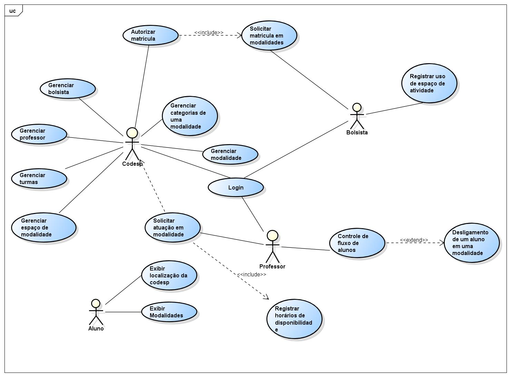

# Modelo de Casos de Uso

## 1. Diagrama de Casos de Uso

## 2. Listagem dos detalhamentos dos casos de uso

1. [CDU-001  - Login](cdu-001/detalhamento-001.md)
2. [CDU-002  - Exibir modalidades](cdu-002/detalhamento-002.md)
3. [CDU-003  - Exibir localização da codesp](cdu-003/detalhamento-003.md)
4. [CDU-004  - Solicitar atuação de modalidade](cdu-004/detalhamento-004.md)
5. [CDU-005  - Registrar horários de disponibilidade](cdu-005/detalhamento-005.md)
6. [CDU-006  - Gerenciar espaço de Modalidade](cdu-006/detalhamento-006.md)
7. [CDU-007  - Desligamento de Aluno](cdu-007/detalhamento-007.md)
8. [CDU-008  - Gerenciar bolsista](cdu-008/detalhamento-008.md)
9. [CDU-009  - Gerenciar turmas](cdu-009/detalhamento-009.md)
10. [CDU-010 - Gerenciar professor](cdu-010/detalhamento-010.md)
11. [CDU-011 - Controle de fluxo](cdu-011/detalhamento-011.md)
12. [CDU-012 - Gerenciar modalidade](cdu-012/detalhamento-012.md)
13. [CDU-013 - Gerenciar categoria de uma modalidade](cdu-013/detalhamento-013.md)
14. [CDU-014 - Autorizar matrícula](cdu-014/detalhamento-014.md)
15. [CDU-015 - Solicitar matrícula em modalidade](cdu-015/detalhamento-015.md)
16. [CDU-016 - Registrar uso de espaço de atividade](cdu-016/detalhamento-016.md)
