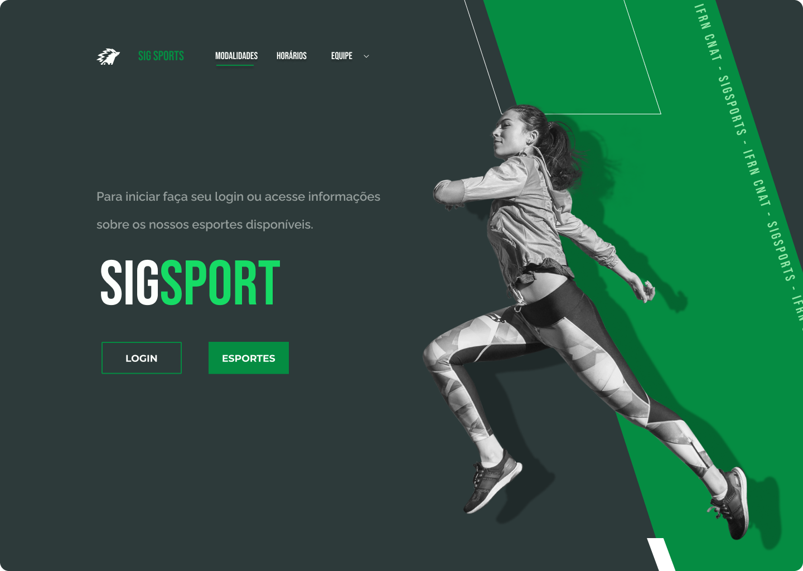
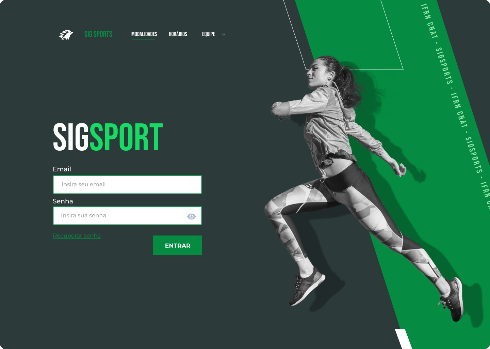
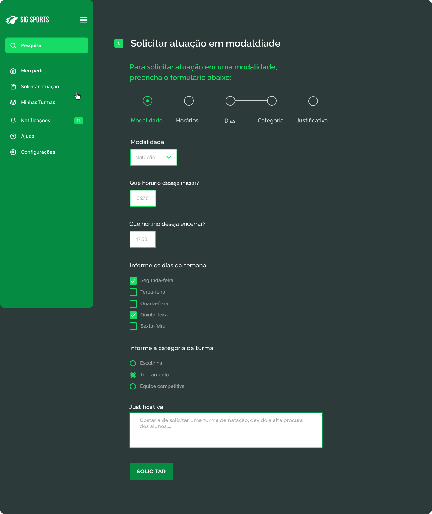
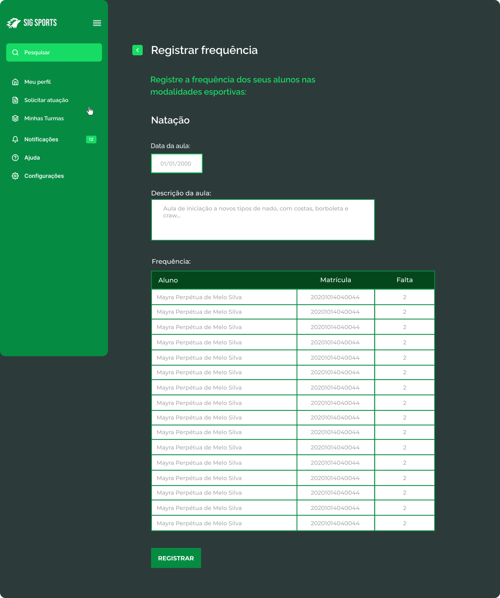
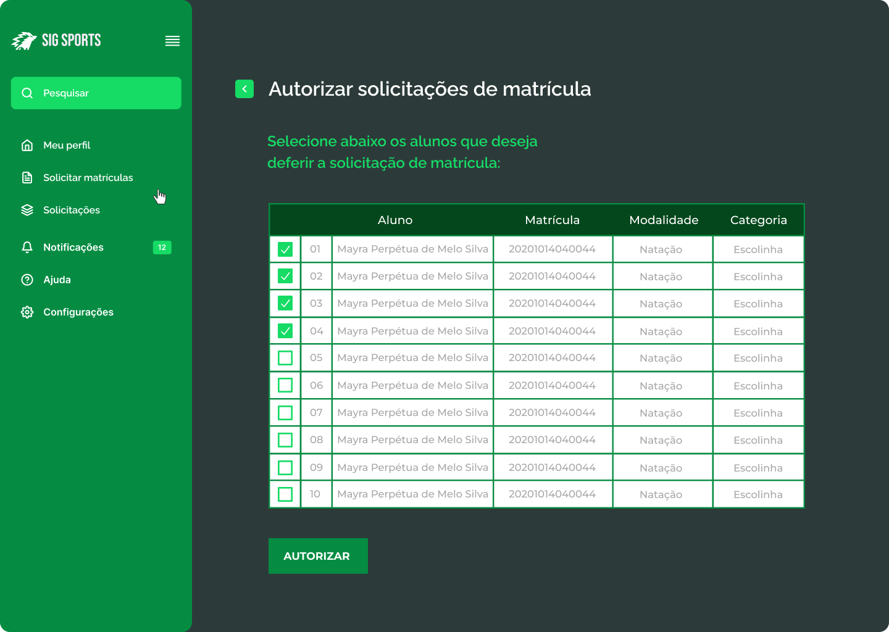
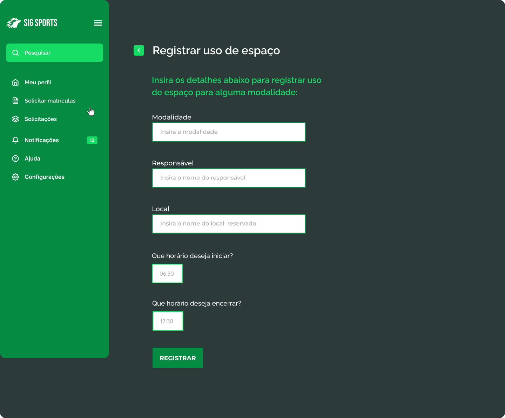
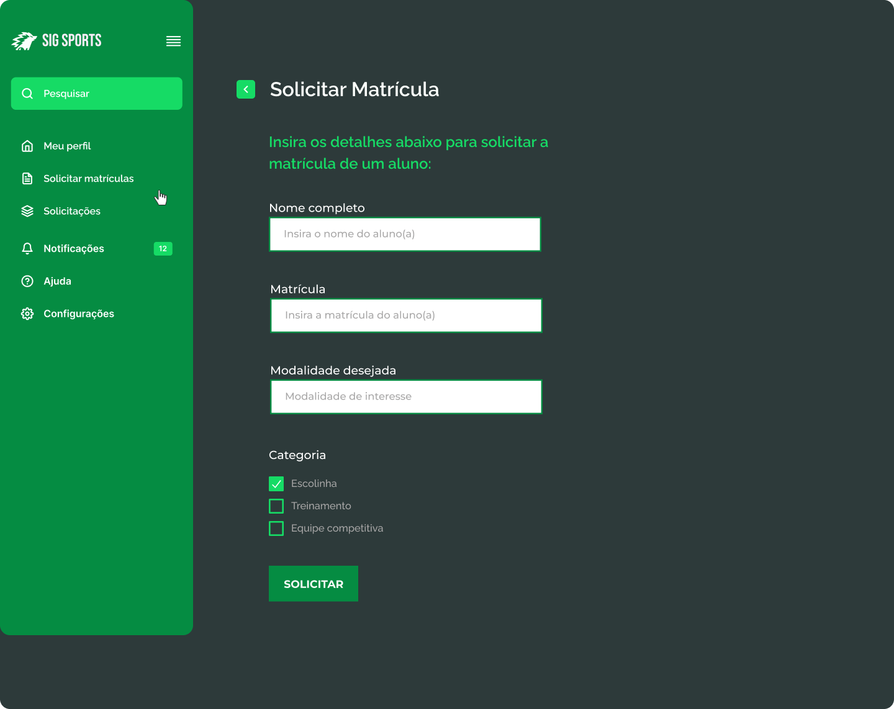

# Protótipos de Interface do Usuário

## 1.Página inicial

## 2.Login

## 3.Professor - Solicitar atuação em modalidade

## 4.Professor - Registrar frequência

## 5.Codesp - Autorizar solicitações de matrícula

## 4.Bolsista - Registrar uso de espaço

## 4.Bolsista - Solicitar matrícula

